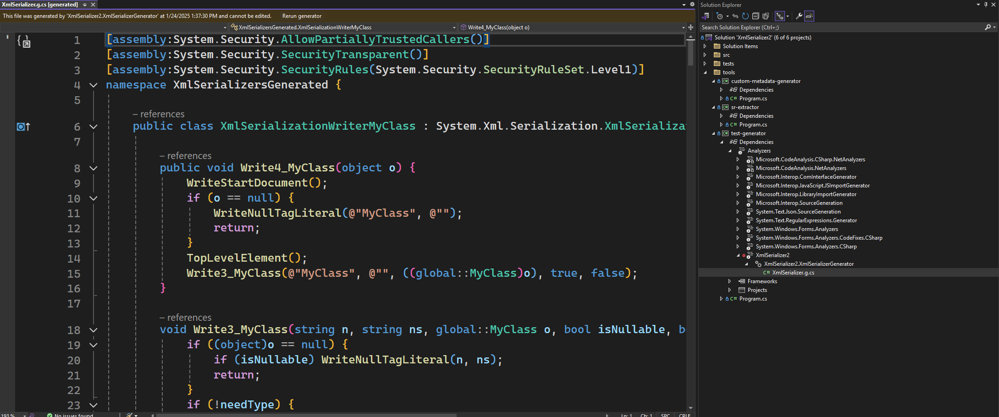

# System.Xml.XmlSerializer with Source Generator

This project is to migrate the XmlSerializer generator (sgen) infrastructure to run as a source generator. 

## Challenges

- The existing code heavily relies on System.Reflection to interrogate the types and we want to reuse as much of the code as possible. https://github.com/davidfowl/Roslyn.Reflection can help with that
- The System.Reflection code expected to be able to get the attributes as their actual runtime objects. A [translation layer](src/XmlSerializer2/Roslyn.Reflection/MetadataCustomAttributeProvider.cs) added on top of Roslyn.Reflection helps with that
- Type equality is expected. The pattern of `Type.Equals(OtherType)` works fine, however `Type == OtherType` does not seem to work (the `==` operator explicitly fails if only oneside is a `RuntimeType`). Other checks, such as `IsAssignableFrom` need to be reworked as well
- There is a lot of duplication of code from `dotnet/runtime` since there are internal members we need. Currently, they're the same name as the ones that are even exposed publicly, but are local to the project (the warning is disabled to hide that fact).

## Try it out

The `tools/test-generator` project is hooked up to run the analyzer and with the latest VS versions, it will automatically reload if there are changes.

